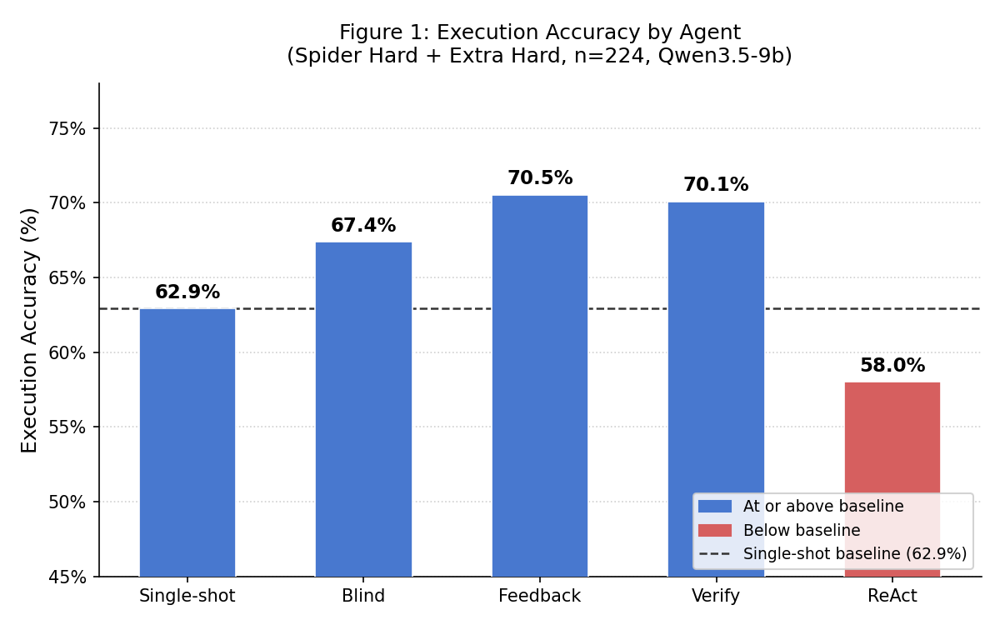

# Does Execution Feedback Help? A Study of Correction and Tool-Use Mechanisms for Text-to-SQL on Spider

## Abstract

We evaluate six text-to-SQL configurations on the Spider Hard and Extra Hard subset (n = 224) using Qwen3.5-9b as the backbone model. A feedback loop that retries on execution errors reaches 70.5% execution accuracy (+7.6 pp over the single-shot baseline). Blind self-correction reaches 67.4% without execution access. A verify-and-revise agent that checks returned rows against the question nearly ties the feedback loop at 70.1% but makes 2.71 API calls per example versus ~1.2 for the feedback loop. A ReActAgent with four tools and OpenAI function calling drops below the single-shot baseline at 58.0% (−4.9 pp). Chaining error feedback, blind review, and verification into an explicit pipeline gives the best result at 72.3% (+1.8 pp over the feedback loop), though the gain is modest. Analysis shows that execution feedback eliminates all runtime errors but converts them into silent wrong-result failures; the pipeline narrows these from 66 to 61 of 224 examples but does not close the gap, because the remaining failures are logical errors — and, in 13 cases, correct results scored wrong only because their columns are returned in a different order.

## 1. Introduction

Large language models can translate natural language questions into SQL with impressive fluency, but they fail more often on structurally complex queries — subqueries, set operations, multi-table joins. A common failure mode is silent: the model produces syntactically valid SQL that runs but returns the wrong answer, with no signal that anything went wrong.

One proposed remedy is the execution feedback loop: generate SQL, execute it against the target database, observe the result or error, and revise. If the query raises a runtime error, the error message is a concrete, actionable signal the model can act on. A weaker alternative is blind self-correction: ask the model to review its own output without executing it, in the style of DIN-SQL's self-review pass. This study asks which signal — execution error, blind review, or no feedback at all — translates into measurable accuracy gains on hard queries.

We evaluate six configurations on the Spider Hard and Extra Hard subsets using the same model and prompt. The feedback loop raises execution accuracy (EX) by 7.6 percentage points over the single-shot baseline; blind self-correction gains 4.5 percentage points. A verify-and-revise agent nearly matches the feedback loop (70.1% vs 70.5%) at higher cost. A ReActAgent with four tools (function calling) underperforms single-shot (58.0%), suggesting that autonomous tool use does not pay off on clean Spider schemas with this model. Chaining feedback, blind review, and verification into an explicit pipeline gives the best result (72.3%), but only +1.8pp over the feedback loop. The analysis reveals a ceiling: execution feedback eliminates all runtime errors but converts them into silent wrong-result failures, which even the pipeline only narrows (66 to 61) rather than closes.

## 2. Related Work

The ReAct framework (Yao et al., 2023) interleaves reasoning and acting — generating an action, observing the environment's response, and updating the plan. Reflexion (Shinn et al., 2023) extends this with verbal self-reflection over past failures. Both suggest that grounding LLM outputs in real environment feedback improves performance on multi-step tasks.

In the text-to-SQL setting, DIN-SQL (Pourreza & Rafiei, 2023) decomposes queries into sub-problems and includes a self-review pass that asks the model to check its own output without execution. Self-debugging approaches (Chen et al., 2024) explicitly use execution traces and error messages as revision signals. More recent agent frameworks combine these ideas: DAIL-SQL (Gao et al., 2023) systematises prompt design and contributes the Code Representation format we adopt; MAC-SQL (Wang et al., 2023) pairs a decomposer with a Refiner that executes SQL and revises on error — the same mechanism as our feedback loop; and CHESS (Talaei et al., 2024) adds a Unit Tester that scores candidate queries against generated checks, closely related to our verify-and-revise agent. Spider 1.0 (Yu et al., 2018) remains the standard benchmark; execution accuracy — whether the predicted query returns the same result set as the gold query — is the primary metric because it is invariant to surface-level SQL differences.

## 3. Benchmark and Dataset

We evaluate on Spider 1.0 (Yu et al., 2018), a large-scale, cross-domain text-to-SQL benchmark of 200 databases in which the databases used for training and evaluation do not overlap, so a model cannot succeed by memorising schema-specific query templates. Spider is chosen deliberately: its databases are small, clean, and synthetic, with human-readable column names and no value-formatting noise. This suits our goal of isolating the contribution of correction and tool-use mechanisms — on Spider, most failures are SQL-structural (wrong column, missing join, incorrect aggregation) rather than failures of value interpretation, which dominate on larger, noisier benchmarks such as BIRD and would confound the comparison.

We further restrict evaluation to the Hard and Extra Hard subsets of the development set (n = 224: 148 Hard, 76 Extra Hard). Easy and Medium questions are largely solved by a single-shot prompt and offer little diagnostic value: their trivial structure rarely produces the errors that correction mechanisms are meant to fix. Hard and Extra Hard questions — involving nested subqueries, multi-condition GROUP BY, HAVING, multi-table joins, and the set operations INTERSECT, UNION, and EXCEPT — are where those mechanisms are expected to differ. Hardness labels are assigned by a simplified reimplementation of Spider's official classifier based on SQL structural complexity; boundary cases may be misclassified relative to the official tool (see Limitations).

We report execution accuracy (EX): both the gold and predicted SQL are executed against the SQLite database and their results are compared as unordered sets of rows (frozensets). EX is insensitive to column aliases and row ordering, and credits any query returning the correct result regardless of surface form.

## 4. Method

The agent is structured around three components. `SQLExecutor` (src/tools.py) wraps SQLite execution, returning an `ExecutionResult` that holds either the result rows or an error message. `format_schema` renders a Spider database schema as CREATE TABLE statements (the Code Representation format of DAIL-SQL; Gao et al., 2023), giving the model a compact representation of the available tables and columns. Six configurations (src/agents.py) share the same abstract interface, differing only in how — and whether — feedback is provided. All of them use the same schema-aware prompt format (the Code Representation format above); the single-shot baseline is therefore schema-aware direct prompting, and the other configurations add correction or tool-use mechanisms on top of that shared input.

`SingleShotAgent` calls the LLM once and returns the SQL as-is. This is the baseline: no retries, no feedback, one API call per example.

`FeedbackLoopAgent` calls the LLM, executes the SQL via `SQLExecutor`, and on error appends the error message to the conversation and retries — up to `max_retries` attempts. It stops early on the first successful execution, so the average call count is well below the maximum when execution errors are rare.

`BlindCorrectionAgent` calls the LLM once to generate SQL, then makes up to `max_retries − 1` additional calls asking the model to review its own output against the schema and question, without executing. It stops early if the revised SQL is identical to the current one (normalised to lowercase with collapsed whitespace), avoiding redundant calls when the model cannot suggest an improvement.

`VerifyAndReviseAgent` executes the SQL, then calls a separate verifier LLM to judge whether the result correctly answers the question. If the verifier returns NO, it revises and retries. A `last_clean_sql` fallback ensures that a verify-triggered revision that errors does not replace a previously clean result, giving this agent the same execution-error guarantee as the feedback loop.

`ReActAgent` uses OpenAI function calling to give the LLM autonomous access to four tools: `execute_sql`, `sample_rows`, `describe_table`, and `get_distinct_values`. The model decides which tools to call and when to stop exploring and return SQL. Before returning the final SQL, the agent executes it; if it errors, it falls back to the last clean `execute_sql` result from the tool loop.

`PipelineAgent` chains three mechanisms into one explicit flow with a fixed order and separate budgets, so they do not compete for a shared retry counter: (1) error feedback — generate and retry on execution errors; (2) blind review — one self-review pass over the clean SQL; (3) verify — one verifier call on the returned rows, with one revision if it says NO. A per-example `stage_changed` field records which stage, if any, altered the final query.

All six configurations use the same model, system prompt, and schema formatter. They differ in whether and how feedback is provided, whether the LLM can invoke tools autonomously, and whether mechanisms are combined.

## 5. Experimental Setup

**Model.** Qwen3.5-9b via OpenRouter, temperature 0, max_tokens 2048.

**Conditions.** Single-shot (`max_retries=1`), blind self-correction (`max_retries=3`), feedback loop (`max_retries=3`), verify-and-revise (`max_retries=3`), ReActAgent (`max_retries=8`; higher budget to allow tool exploration before producing final SQL), and the pipeline (`error_retries=2`, then one blind-review pass and one verify pass — up to five calls per example). The oracle baseline (gold SQL as prediction) verifies the evaluation infrastructure and achieves ~100% EX.

**Implementation note.** An early run with `max_tokens=512` produced 28% EX because Qwen3's internal reasoning tokens consumed the entire token budget, leaving the response content empty. Raising the limit to 2048 eliminated this artifact (0/224 empty predictions across all runs). Qwen3 occasionally prepends reasoning prose before the SQL in its response; the parser extracts the first top-level SELECT or WITH statement to handle this.

## 6. Results

**Table 1. Main results.**

| Agent | Tools | Correct | EX | vs single-shot |
|---|---|---|---|---|
| Single-shot | none | 141/224 | 62.9% | — |
| Blind self-correction | none | 151/224 | 67.4% | +4.5pp |
| Feedback loop | execute_sql | 158/224 | 70.5% | +7.6pp |
| Verify-and-revise | execute_sql | 157/224 | 70.1% | +7.2pp |
| ReActAgent | execute_sql, sample_rows, describe_table, get_distinct_values | 130/224 | 58.0% | −4.9pp |
| Pipeline (feedback + blind + verify) | execute_sql | 162/224 | 72.3% | +9.4pp |

The pipeline chains three mechanisms in a fixed order — error feedback, then a blind review pass, then result verification — each with its own budget. It is the best-performing condition at 72.3%, +1.8pp over the feedback loop alone. The gain is real but modest: the three stages changed 65 SQL queries in total (29 from error feedback, 18 from blind review, 18 from verification) for a net improvement of only +4 examples over the feedback loop (+11 fixed, −7 regressed), and it narrows the wrong-result count from 66 to 61 rather than closing it.

**By hardness.**

| | Single-shot | Blind | Feedback | Verify | ReAct | Pipeline |
|---|---|---|---|---|---|---|
| Hard (n=148) | 64.2% | 65.5% | 68.9% | 68.2% | 58.1% | 69.6% |
| Extra Hard (n=76) | 60.5% | 71.1% | 73.7% | 73.7% | 57.9% | 77.6% |

Extra Hard questions improve more across the board for the feedback-style agents, consistent with Extra Hard queries more often producing syntax errors that retry loops can address. Verify-and-revise matches feedback exactly on Extra Hard (73.7%). ReAct trails single-shot on both hardness levels.

**By SQL pattern.** Table 2 shows EX broken down by the structural pattern present in the gold SQL.

| Pattern | n | Single-shot | Blind | Feedback | Verify | ReAct | Pipeline |
|---|---|---|---|---|---|---|---|
| Nested SELECT | 157 | 63.7% | 67.5% | 72.6% | 72.0% | 56.1% | 74.5% |
| JOIN | 105 | 52.4% | 59.0% | 62.9% | 61.0% | 47.6% | 64.8% |
| NOT IN | 46 | 82.6% | 80.4% | 91.3% | 89.1% | 73.9% | 89.1% |
| GROUP BY | 39 | 30.8% | 43.6% | 38.5% | 46.2% | 35.9% | 51.3% |
| INTERSECT | 38 | 57.9% | 81.6% | 76.3% | 78.9% | 60.5% | 84.2% |
| EXCEPT | 31 | 71.0% | 71.0% | 77.4% | 74.2% | 58.1% | 77.4% |
| ORDER BY | 29 | 65.5% | 65.5% | 69.0% | 72.4% | 55.2% | 69.0% |
| HAVING | 15 | 26.7% | 40.0% | 40.0% | 53.3% | 46.7% | 53.3% |
| UNION | 11 | 45.5% | 36.4% | 54.5% | 54.5% | 54.5% | 54.5% |

## 7. Analysis

**Failure breakdown.**

| Reason | Single-shot | Blind | Feedback | Verify | ReAct | Pipeline |
|---|---|---|---|---|---|---|
| execution_error | 32 | 14 | 0 | 1 | 0 | 1 |
| wrong_result | 51 | 59 | 66 | 66 | 94 | 61 |
| Total failures | 83 | 73 | 66 | 67 | 94 | 62 |

The single-shot run produced 32 execution errors and 51 wrong-result failures (83 total). Blind self-correction reduces execution errors to 14 — catching some syntax mistakes through review alone — while wrong-result rises to 59 (73 total failures). The feedback loop eliminates all 32 execution errors entirely and brings total failures to 66, all wrong-result. Verify-and-revise nearly matches feedback (70.1% vs 70.5%) at higher API cost, with no meaningful reduction in wrong-result. ReActAgent eliminates execution errors (0) but wrong-result jumps to 94 — the model uses tools to explore the database but then returns an intermediate exploration query as its final answer rather than the SQL that answers the question. Whether this reflects a limitation specific to Qwen3.5-9b's function-calling calibration or a more general mismatch between ReAct-style tool use and the SQL generation task cannot be determined from a single model; this is left to future work. The pipeline is the only configuration to reduce wrong-result below the feedback loop (66 to 61), by combining three correction stages, but the reduction is small.

**What the remaining failures actually are.** Re-executing the 66 wrong-result cases left by the feedback loop splits them in two. Thirteen are false negatives: the predicted result is correct but its columns are returned in a different order than the gold query, so the strict set-based comparison scores them wrong. For example, for "the average and maximum age for each pet type," the gold query selects `(avg, max, pettype)` while the model returns `(pettype, avg, max)` — identical content, different order. Adjusting the metric to compare columns as an unordered set would raise the feedback loop's EX from 70.5% to roughly 76%. The remaining 53 are genuine logical errors, dominated by two patterns: wrong-table joins (the model joins an extra table such as `model_list` that changes the result) and incorrect subquery logic (e.g. using `MAX(...)` where the question asks for the row with the maximum, or writing the wrong branch of a `NOT IN` / `EXCEPT` condition). Neither class is fixable by the available tools, which inspect values and column names rather than table relationships — which is why the pipeline combines correction mechanisms instead of adding tools, and why even so it only narrows the ceiling. These findings echo broader concerns that text-to-SQL benchmarks and their evaluation are imperfect (Text-to-SQL Benchmarks are Broken, 2024).

**Where feedback helps.** Feedback loop shows the largest gains on patterns that frequently produce runtime errors on a first attempt: NOT IN (+8.7pp), Nested SELECT (+8.9pp), JOIN (+10.5pp), and HAVING (+13.3pp). INTERSECT shows the largest fb-delta (+18.4pp over single-shot), consistent with INTERSECT/UNION/EXCEPT syntax being easy to get slightly wrong.

**Blind vs feedback.** Blind self-correction sits between the two: it partially reduces execution errors (32 → 14) and improves wrong-result cases where the model can catch its own mistake through re-reading the schema. Two patterns show blind beating feedback — INTERSECT (81.6% vs 76.3%) and GROUP BY (43.6% vs 38.5%) — but both have n ≈ 38, so a handful of examples separates them; these reversals should be treated as tentative, not structural.

**The ceiling of error-only feedback.** All 66 remaining failures in the feedback loop condition are wrong-result. The model receives no signal that its output is logically incorrect; retrying produces the same mistake. Closing this gap would require richer feedback — showing the model a sample of its returned rows alongside the expected result — which is not possible in a blind evaluation setting. This points to a fundamental limit: execution error feedback is a strong signal for syntactic failures and a silent one for logical failures.

**Verify-and-revise does not close the wrong-result ceiling.** VerifyAndReviseAgent adds a verifier call after each clean execution, showing the model the returned rows and asking whether they correctly answer the question. Per-example comparison against the feedback loop reveals only 3 genuine new correct answers: of the 27 examples where the verifier said NO and the final result was correct, 24 were already correct under the feedback loop — the verifier fired on a good result, a revision ran, and the answer happened to stay correct. The verifier passed 66 wrong-result queries without flagging them, yielding near-zero recall on the cases it was designed to catch. Net gain over the feedback loop: ≈ 0. The limit is the model's ability to judge logical correctness from a 10-row sample, not the architecture.

**UNION** shows the sharpest degradation under blind self-correction (45.5% → 36.4%), while feedback loop improves it (45.5% → 54.5%). NOT IN also dips slightly under blind (82.6% → 80.4%). Both the UNION and NOT IN movements are likely noise given their small sample sizes (n = 11 and n = 46 respectively).

## 8. Limitations and Future Work

This study evaluates a single model (Qwen3.5-9b) with a fixed prompt. Conclusions may not generalise to larger or differently trained models. The hardness classifier is a simplified reimplementation of Spider's official one; misclassification of boundary cases could shift the Hard/Extra Hard split.

Two Qwen3-specific mitigations were required: the `/no-think` prompt suffix to suppress extended-reasoning mode, and raising `max_tokens` to 2048 to prevent the reasoning budget from consuming the entire response. These may not generalise to other models.

The evaluation tracks execution accuracy and the execution-error / wrong-result split, but does not separately measure some diagnostics that would sharpen the error analysis — in particular the rate of hallucinated schema references (queries naming tables or columns that do not exist), which are currently folded into the execution-error count rather than counted on their own. Because temperature-0 decoding is not perfectly reproducible across runs, small cross-agent gaps of one to two points are within run-to-run noise, so only larger differences are treated as meaningful.

Future work should explore three directions. First, running the same comparison with a second model (GPT-4o-mini) to test whether stronger models show smaller feedback gains and whether the ReAct result holds on a second model. Second, result-level feedback was attempted via VerifyAndReviseAgent but failed on verifier recall — the verifier passed 66 wrong-result queries it should have caught. Closing the wrong-result ceiling likely requires gold-comparison feedback (showing the model both its result and the expected result), which is not available in a blind evaluation setting. Third, evaluating on BIRD, where larger and noisier schemas would make schema retrieval and value lookup tools more impactful than on clean Spider schemas.

## 9. Conclusion

On clean Spider schemas with a small model, execution feedback is the most efficient correction mechanism: the feedback loop reaches 70.5% EX at roughly 1.2 API calls per example, a 7.6 pp gain over single-shot. Blind self-correction adds 4.5 pp without any execution access, at a higher call count. Verify-and-revise ties the feedback loop at 70.1% but costs 2.71 calls per example, with near-zero net benefit from the verification layer — the verifier catches only 3 previously wrong examples while adding 24 false-positive revisions on already-correct results. ReActAgent with four tools drops below single-shot (58.0%), showing that autonomous tool use over a clean schema hurts rather than helps on this task and model. Chaining error feedback, blind review, and verification into an explicit pipeline gives the best overall result (72.3%, +1.8 pp over feedback alone), but the gain is modest and shows diminishing returns: three stages altered 65 queries for a net of only +4 correct. The fundamental obstacle is not syntactic: after error feedback eliminates all runtime errors, the pipeline still leaves 61 of 224 examples wrong, and re-executing those failures shows 13 are correct results scored wrong only for column ordering while the rest are genuine logical mistakes — wrong-table joins and incorrect subquery logic — that no execution error, verifier, or value-inspecting tool can diagnose. Closing that gap requires either a less brittle evaluation metric or output-level feedback that compares against the expected result.

## References

Chen, X., Lin, M., Schärli, N., and Zhou, D. (2024). Teaching Large Language Models to Self-Debug. In *Proceedings of ICLR 2024*.

Gao, D., Wang, H., Li, Y., Sun, X., Qian, Y., Ding, B., and Zhou, J. (2023). Text-to-SQL Empowered by Large Language Models: A Benchmark Evaluation (DAIL-SQL). *arXiv:2308.15363*.

Pourreza, M. and Rafiei, D. (2023). DIN-SQL: Decomposed In-Context Learning of Text-to-SQL with Self-Correction. In *Advances in Neural Information Processing Systems (NeurIPS)*, 36.

Shinn, N., Cassano, F., Gopinath, A., Narasimhan, K., and Yao, S. (2023). Reflexion: Language Agents with Verbal Reinforcement Learning. In *Advances in Neural Information Processing Systems (NeurIPS)*, 36.

Talaei, S., Pourreza, M., Chang, Y.-C., Mirhoseini, A., and Saberi, A. (2024). CHESS: Contextual Harnessing for Efficient SQL Synthesis. *arXiv preprint*.

Text-to-SQL Benchmarks are Broken: An In-Depth Analysis of Annotation Errors (2024). *arXiv preprint* [verify authors/venue].

Wang, B., Ren, C., Yang, J., Liang, X., Bai, J., Chai, L., Yan, Z., Zhang, Q.-W., Yin, D., Sun, X., and Li, Z. (2023). MAC-SQL: A Multi-Agent Collaborative Framework for Text-to-SQL. *arXiv preprint*.

Yao, S., Zhao, J., Yu, D., Du, N., Shafran, I., Narasimhan, K., and Cao, Y. (2023). ReAct: Synergizing Reasoning and Acting in Language Models. In *Proceedings of ICLR 2023*.

Yu, T., Zhang, R., Yang, K., Yasunaga, M., Wang, D., Li, Z., Ma, J., Li, I., Yao, Q., Roman, S., Zhang, Z., and Radev, D. (2018). Spider: A Large-Scale Human-Labeled Dataset for Complex and Cross-Domain Semantic Parsing and Text-to-SQL Task. In *Proceedings of EMNLP 2018*.
